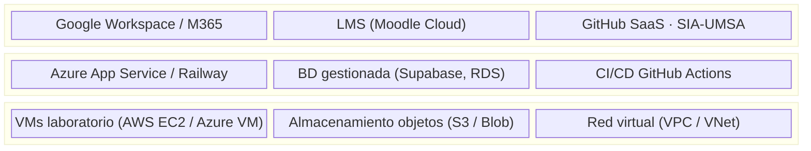
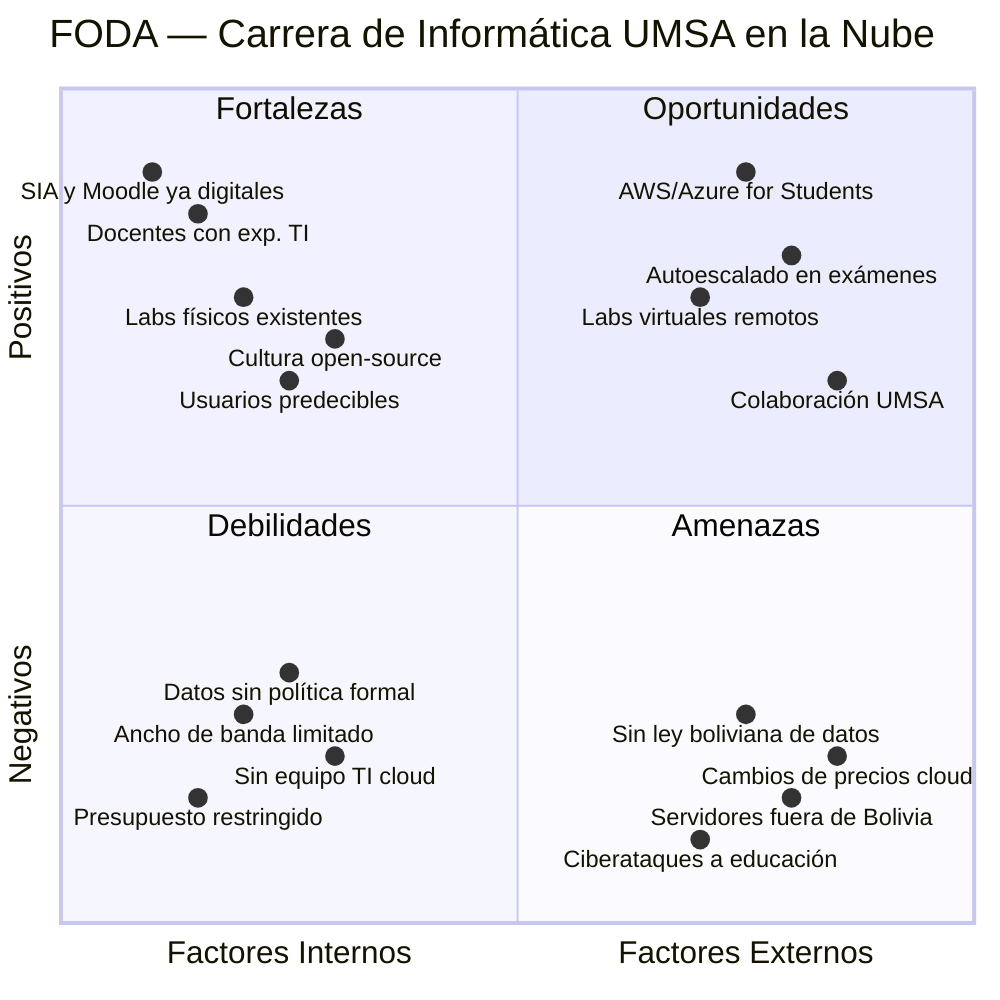
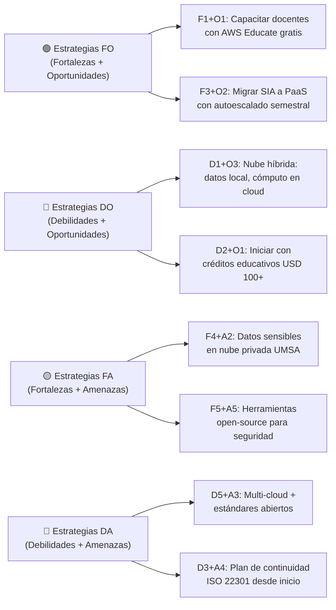
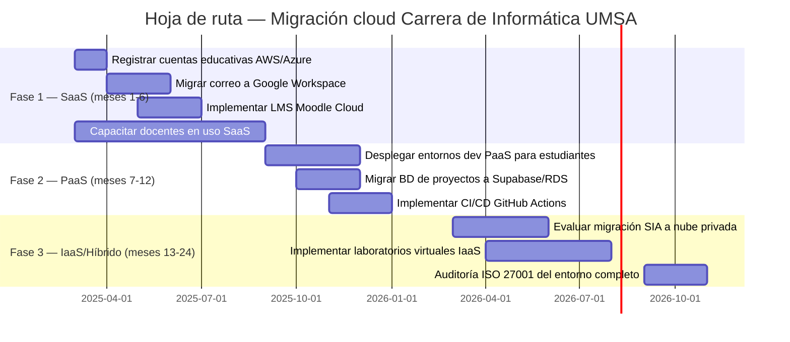
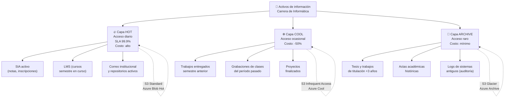
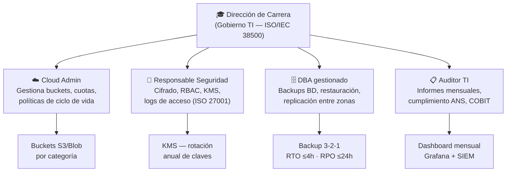
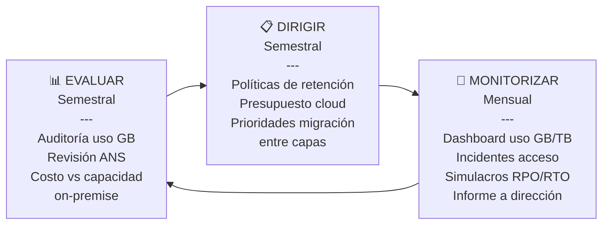
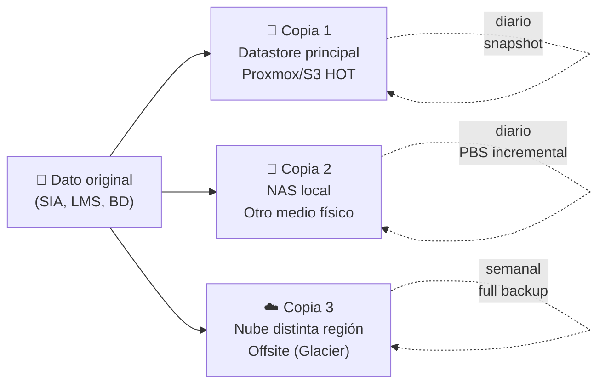
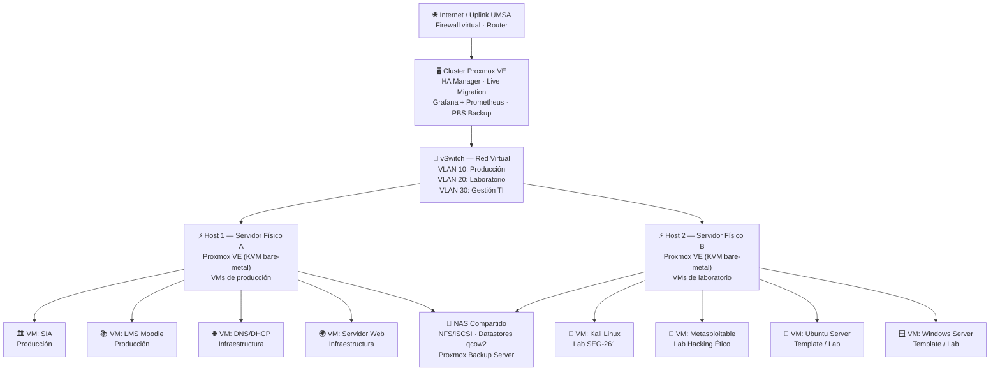
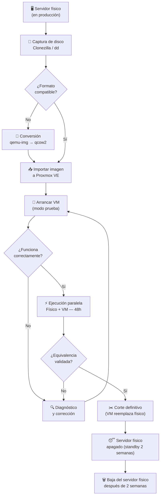

# Computación en la Nube — Carrera de Informática UMSA
> SIS-372 · Universidad Mayor de San Andrés · La Paz, Bolivia

---

## 1. Implementación Cloud: SaaS, PaaS, IaaS — Carrera de Informática

### 1.1 Diagrama de capas de servicio (modelo de responsabilidad compartida)

### 1.2 Tabla de responsabilidades (modelo RACI simplificado)

| Componente | IaaS | PaaS | SaaS |
|---|:---:|:---:|:---:|
| Hardware físico | ☁ Proveedor | ☁ Proveedor | ☁ Proveedor |
| Virtualización / Hipervisor | ☁ Proveedor | ☁ Proveedor | ☁ Proveedor |
| Sistema Operativo | 🏛 Carrera | ☁ Proveedor | ☁ Proveedor |
| Runtime / Middleware | 🏛 Carrera | ☁ Proveedor | ☁ Proveedor |
| Aplicación / Software | 🏛 Carrera | 🏛 Carrera | ☁ Proveedor |
| Datos académicos | 🏛 Carrera | 🏛 Carrera | 🏛 Carrera |
| Seguridad de accesos | 🏛 Carrera | Compartida | ☁ Proveedor |
| Identidad y usuarios | 🏛 Carrera | 🏛 Carrera | 🏛 Carrera |

### 1.3 Tabla de normas ISO por capa

| Capa | Norma principal | Enfoque aplicado |
|---|---|---|
| **IaaS** | ISO/IEC 27001 (A.12, A.13) | Seguridad en operaciones, comunicaciones cifradas |
| **IaaS** | ISO 22301 | Continuidad del negocio para VMs críticas |
| **IaaS** | COBIT 2024 BAI10 | Gestión de configuración e inventario de VMs |
| **PaaS** | ISO/IEC 27017 | Controles cloud específicos para plataformas |
| **PaaS** | COBIT 2024 APO09 | Acuerdos de nivel de servicio (ANS) con proveedor |
| **PaaS** | COBIT 2024 DSS01 | Gestión de operaciones en plataformas gestionadas |
| **SaaS** | ISO/IEC 38500 | Gobierno TI: evaluar, dirigir, monitorizar |
| **SaaS** | ISO/IEC 27018 | Protección de datos personales de estudiantes |
| **SaaS** | ISG Cloud | Marco de gobierno de seguridad para cloud |

### 1.4 Casos de uso concretos por capa — Carrera de Informática

| Capa | Servicio | Proveedor sugerido | Asignatura / área beneficiada |
|---|---|---|---|
| SaaS | Correo institucional | Google Workspace | Toda la carrera |
| SaaS | LMS (cursos, tareas) | Moodle Cloud | Todas las asignaturas |
| SaaS | Control de versiones | GitHub (Education) | Programación, IS, Proyectos |
| SaaS | Videoconferencia | Google Meet / Teams | Clases virtuales |
| PaaS | Despliegue de apps web | Railway / Azure App Service | Ingeniería de Software |
| PaaS | BD gestionada | Supabase / Amazon RDS | BD, Análisis de Datos |
| PaaS | Notebooks de análisis | Google Colab Enterprise | Cloud Computing, BI |
| PaaS | CI/CD pipeline | GitHub Actions | DevOps, IS |
| IaaS | VMs de práctica Linux/Win | AWS EC2 / Azure VM | Redes, SO, Admin Sistemas |
| IaaS | Entorno hacking ético | AWS (VPC aislada) | SEG-261 Ethical Hacking |
| IaaS | Almacenamiento de tesis | S3 / Azure Blob | Titulación |
| IaaS | Red virtual laboratorio | VPC / VNet | SEG-372, Redes II |

---

## 2. Análisis FODA — Salto a la Nube (Carrera de Informática UMSA)

### 2.1 Matriz FODA completa

### 2.2 Tabla FODA detallada

#### Fortalezas (Factores Internos Positivos)

| # | Fortaleza | Impacto | Relevancia cloud |
|---|---|:---:|---|
| F1 | Docentes con experiencia en redes, SO y seguridad | Alto | Reducen curva de aprendizaje cloud |
| F2 | Laboratorios físicos existentes (base para modelo híbrido) | Alto | Permiten nube híbrida sin inversión total |
| F3 | Comunidad de usuarios predecible por semestre | Medio | Facilita dimensionamiento de autoescalado |
| F4 | SIA, Moodle y correo UMSA ya digitalizados | Alto | Base de adopción digital ya existe |
| F5 | Cultura open-source (Linux, Python, herramientas libres) | Medio | Ecosistema compatible con cloud nativo |
| F6 | Estudiantes nativos digitales dispuestos a adoptar | Medio | Menor resistencia al cambio |
| F7 | Infraestructura de red campus disponible | Bajo | Punto de partida para conectividad cloud |

#### Oportunidades (Factores Externos Positivos)

| # | Oportunidad | Impacto | Acción sugerida |
|---|---|:---:|---|
| O1 | AWS Educate / Azure for Students (créditos gratuitos) | Alto | Registrar cuentas educativas sin costo |
| O2 | Autoescalado en picos de inscripción y exámenes | Alto | Migrar SIA a PaaS con autoescalado |
| O3 | Laboratorios virtuales accesibles desde fuera del campus | Alto | Desplegar templates VMs en cloud |
| O4 | Acuerdos educativos con GitHub, JetBrains, etc. | Medio | Tramitar GitHub Education Pack |
| O5 | UMSA se posiciona como referente cloud en Bolivia | Medio | Publicar casos de uso como papers |
| O6 | Colaboración interinstitucional con otras facultades | Medio | Pool compartido de recursos cloud |

#### Debilidades (Factores Internos Negativos)

| # | Debilidad | Impacto | Mitigación |
|---|---|:---:|---|
| D1 | Ancho de banda insuficiente en campus UMSA | Alto | Priorizar servicios cloud con UI ligera |
| D2 | Presupuesto TI limitado y aprobación burocrática | Alto | Iniciar con créditos educativos gratuitos |
| D3 | Sin equipo TI cloud dedicado (docentes con doble rol) | Alto | Capacitar 1-2 docentes como Cloud Admin |
| D4 | Datos personales de estudiantes sin política formal | Medio | Redactar política de datos antes de migrar |
| D5 | Riesgo de Vendor Lock-in sin estándares abiertos | Medio | Usar formatos abiertos (OpenAPI, S3-compatible) |
| D6 | Curva de aprendizaje en ANS y facturación cloud | Bajo | Capacitación en gestión de costos cloud |

#### Amenazas (Factores Externos Negativos)

| # | Amenaza | Impacto | Mitigación |
|---|---|:---:|---|
| A1 | Ausencia de ley boliviana de protección de datos cloud | Alto | Aplicar ISO/IEC 27018 como marco propio |
| A2 | Servidores del proveedor fuera de Bolivia | Alto | Mantener datos sensibles en nube privada |
| A3 | Cambios imprevistos de precios del proveedor | Medio | Contratos con precios fijos, estrategia multi-cloud |
| A4 | Caídas del proveedor paralizan actividad académica | Alto | SLA 99.9%, plan de continuidad ISO 22301 |
| A5 | Ciberataques a instituciones educativas | Alto | MFA, cifrado, monitoreo continuo (ISO 27001) |

### 2.3 Estrategias cruzadas FODA

### 2.4 Hoja de ruta de migración (basada en FODA)

---

## 3. Análisis de TI para Gestión de Almacenamiento en la Nube

### 3.1 Arquitectura de almacenamiento en capas (tiered storage)

### 3.2 Tabla de clasificación de activos de información

| Activo | Clasificación | Confidencialidad | Retención | Capa | Cifrado |
|---|---|:---:|---|:---:|:---:|
| Notas y calificaciones | Dato personal | Muy alta | 10 años | HOT → ARCH | AES-256 |
| Historial académico | Dato personal | Muy alta | Permanente | HOT → ARCH | AES-256 |
| Datos de inscripción | Dato personal | Alta | 10 años | HOT → COOL | AES-256 |
| Trabajos de titulación | Documento interno | Alta | 10 años | COOL → ARCH | AES-256 |
| Informes de práctica | Documento interno | Media | 5 años | COOL → ARCH | AES-256 |
| Material de clase | Dato interno | Baja | Semestral | HOT → COOL | TLS en tránsito |
| Videos de grabaciones | Dato interno | Baja | 2 años | COOL | TLS en tránsito |
| Código de proyectos | Semipúblico | Baja | Semestral | HOT | - |
| Logs de sistemas | Auditoría | Media | 1 año mínimo | COOL → ARCH | AES-256 |
| Sitio web institucional | Público | Ninguna | Indefinida | HOT | TLS |

### 3.3 Roles TI para gestión de almacenamiento (ISO/IEC 38500)

### 3.4 Controles de seguridad ISO/IEC 27001

| Control ISO 27001 | Descripción | Implementación técnica | Responsable |
|---|---|---|---|
| A.10.1 — Cifrado en reposo | Todos los datos almacenados cifrados | AES-256 en todos los buckets, KMS con rotación anual | Cloud Admin + CISO |
| A.13.2 — Cifrado en tránsito | Toda transferencia cifrada | TLS 1.2+ obligatorio, HTTP prohibido | Cloud Admin |
| A.9.2 — Control de acceso | Acceso basado en rol (RBAC) | Estudiantes: lectura propia; Docentes: lectura/escritura asignatura; Admin: todo | CISO |
| A.12.3 — Backup y recuperación | Regla 3-2-1 | 3 copias, 2 medios, 1 offsite (región distinta). RTO ≤4h, RPO ≤24h | DBA |
| A.12.4 — Monitorización | Logs de acceso en SIEM | Alertas por acceso masivo o descarga inusual | Auditor TI |
| A.18.1 — Cumplimiento legal | Marco legal boliviano + ISO | ISO/IEC 27018 para datos personales de estudiantes | CISO + Dirección |

### 3.5 Ciclo de gobierno TI — Evaluar-Dirigir-Monitorizar (ISO/IEC 38500)

### 3.6 Política de backup — Regla 3-2-1

---

## 4. Virtualización de Servidores — Data Center UMSA / Carrera de Informática

### 4.1 Arquitectura general del Data Center virtualizado

### 4.2 Tabla de pasos completos de virtualización

| # | Paso | Actividades clave | Herramienta | Norma |
|---|---|---|---|---|
| 1 | **Relevamiento hardware** | Inventario CPU/RAM/disco/NIC. Monitorear uso 2 semanas. Calcular ratio de consolidación. | Planilla Excel / Zabbix | COBIT 2024 BAI10 |
| 2 | **Diseño de arquitectura virtual** | Cluster HA 2 hosts. VLANs por función. Almacenamiento NFS compartido. Live migration. | Diagrama de red | ISO/IEC 27001 |
| 3 | **Selección e instalación hipervisor** | Proxmox VE (KVM tipo 1). ISO en USB booteable. IP gestión estática. LVM y red inicial. | Proxmox VE 8.x | Gartner Magic Quadrant |
| 4 | **Almacenamiento compartido** | NAS con OpenMediaVault/TrueNAS. Exportar NFS. Montar datastore en nodos. Instalar PBS. | NFS / iSCSI / PBS | ISO 22301 |
| 5 | **Templates de VM** | Ubuntu 22.04, Kali Linux, Windows Server 2022, Metasploitable 3, Debian mínimal. | Proxmox Clone / qcow2 | — |
| 6 | **Migración P2V** | Clonar disco con Clonezilla → convertir qcow2 → importar Proxmox. 48h prueba paralela. | Clonezilla / qemu-img | ISO 22301 |
| 7 | **Políticas de resource pools** | Cuotas por asignatura (vCPU, RAM). Ciclo de vida VMs por semestre. Snapshot al cierre. | Proxmox Pools | COBIT 2024 DSS01 |
| 8 | **Monitorización y backup** | Grafana + Prometheus. Alertas CPU >90%, disco >80%. Snapshots diarios 7d. Simulacro DR mensual. | Grafana · PBS | ISO/IEC 27001 A.12.3 |

### 4.3 Diagrama de flujo del proceso de virtualización (P2V)

### 4.4 Tipos de virtualización aplicados

| Tipo | Descripción | Implementación en Informática UMSA | Ejemplos de software |
|---|---|---|---|
| **Virtualización completa** | Abstracción total del hardware. SO huésped no requiere modificación. Hipervisor tipo 1 (bare-metal). | Servidores de producción: SIA, LMS, DNS, Web. Máximo aislamiento entre VMs. | VMware ESXi, Proxmox VE (KVM), Hyper-V |
| **Paravirtualización** | SO huésped modificado para comunicarse directamente con el hipervisor. Mayor eficiencia. | Laboratorios con alta densidad de VMs (20+ simultáneas). Mejor rendimiento de red y disco. | Xen, KVM con VirtIO drivers |
| **Virtualización de almacenamiento** | Pool único de almacenamiento compartido accesible desde todos los hosts del cluster. | NAS compartido por NFS. Todos los nodos del cluster acceden al mismo datastore. Live migration habilitada. | OpenMediaVault, TrueNAS, Ceph |
| **Virtualización de escritorio (VDI)** | PC no ejecuta apps localmente; se conecta a escritorio remoto en el Data Center. | Laboratorios de acceso remoto para estudiantes fuera del campus. Reducción de costo de hardware en sala. | Proxmox VE + SPICE, VMware Horizon |
| **Virtualización de red** | vSwitch con VLANs que segmenta el tráfico lógicamente sobre la misma red física. | VLAN 10 producción, VLAN 20 laboratorio aislado, VLAN 30 gestión TI exclusiva. | Open vSwitch (OVS), Proxmox SDN |

### 4.5 Cuadrante Mágico Gartner — Proveedores de virtualización

| Cuadrante | Proveedor | Características | Relevancia para UMSA |
|---|---|---|---|
| **Líder** | VMware (Broadcom) | Máxima madurez, vSphere, vMotion, NSX | Costo de licencia prohibitivo para universidad pública |
| **Líder** | Microsoft Hyper-V | Integrado en Windows Server, Azure Stack | Requiere licencias Windows |
| **Challenger** | Nutanix | HCI (hiperconvergente), AOS | Costo elevado, orientado a empresa |
| **Visionario** | Proxmox VE | Open-source, KVM+LXC, interfaz web | ✅ **Recomendado para UMSA** — sin costo |
| **Nicho** | Oracle VM | Basado en Xen, soporte Oracle DB | Licenciamiento restrictivo |
| **Emergente** | oVirt / RHEV | Red Hat, open-source empresarial | Alternativa viable, mayor complejidad |

### 4.6 Resultado esperado del Data Center virtualizado

| Métrica | Antes (físico) | Después (virtualizado) | Mejora |
|---|:---:|:---:|:---:|
| Servidores físicos activos | 4–6 | 2 (cluster HA) | ~66% reducción |
| VMs/entornos disponibles | 4–6 | 15–25 | +300% |
| Tiempo de despliegue de laboratorio | 2–4 horas | < 5 minutos | 98% más rápido |
| Utilización promedio de CPU | ~20% | ~70–80% | +300% eficiencia |
| Consumo energético estimado | 100% | ~40% | 60% ahorro |
| Tiempo de recuperación ante falla (RTO) | Horas/días | < 30 min (HA automático) | 95% más rápido |
| Costo por entorno de laboratorio | Alto (hardware) | Bajo (clonación de template) | ~80% reducción |

---

## Referencias normativas

| Norma | Versión | Ámbito de aplicación |
|---|---|---|
| ISO/IEC 27001 | 2022 | Gestión de seguridad de la información (controles A.9, A.10, A.12, A.13) |
| ISO/IEC 27017 | 2015 | Controles de seguridad específicos para servicios cloud |
| ISO/IEC 27018 | 2019 | Protección de datos personales en cloud (PII) |
| ISO/IEC 38500 | 2015 | Gobierno de TI — Evaluar, Dirigir, Monitorizar |
| ISO 22301 | 2019 | Continuidad del negocio — RTO/RPO/DR |
| COBIT 2024 | 2024 | Gobierno y gestión de TI empresarial |
| ISG Cloud | 2017 | Marco de gobierno de seguridad para Cloud Computing |
| ISO/IEC 27036 | Draft | Seguridad en servicios externalizados a proveedores |

---

*Documento generado para SIS-372 Computación en la Nube · Carrera de Informática UMSA · La Paz, Bolivia*